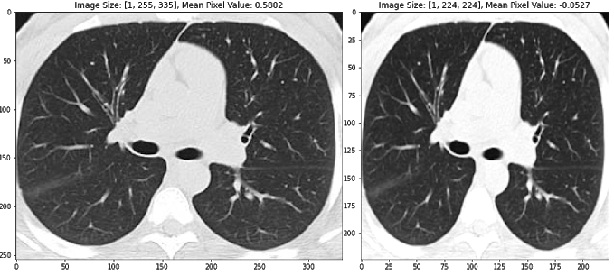
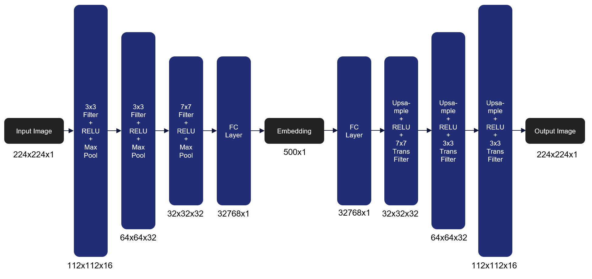

# COVID-19 CT Scan Autoencoder Computer Vision

## Introduction/Background
 
COVID-19 has infected over 30 million people and caused around a million deaths worldwide. The virus can infect the upper or lower part of the respiratory tract. Doctors have reported signs of respiratory inflammation on a chest CT scan of COVID-19 patients. Machine learning approaches on CT scan images can help differentiate between healthy and COVID-19 patients, and also predict prognosis of COVID-19 infected patients. An automated prognosis prediction model could help physicians quickly treat patients.
 
## Problem definition
 
Develop a machine learning approach to aid the differentiation between healthy and COVID-19 patients, and in the prognosis of COVID-19 infected patients using CT scan images.

## Methodology

Because the CT images are not well labelled, we propose an unsupervised learning approach that can be tied back to existing metadata, like mortality, age, BMI, etc. To accomplish this, we will train an Autoencoder model to create a low-dimensional representation of each image (Bank et al. 2020), and then use different clustering methods to determine optimal groupings for these images based on their encoding (Song et al. 2013)(Guo et al. 2017). Once these groups are instantiated, we can then associate image metadata to each cluster to determine whether there are statistically significant attributes tied to specific clusters. If it could be proven that attributes like mortality rate or success with intubation are linked to certain clusters, that information could be incredibly valuable for clinical outcomes. Also, although we have limited prognosis labels, we will also determine autoencoder performance by trying to classify the image based on the encoding using fully connected layers.

## Dataset Description

The SARS-CoV-2 CT-scan dataset consists of 2482 CT scans from 120 patients, with 1252 CT scans of 60 patients infected by SARS-CoV-2 from males (32) and females (28), and 1230 CT scan images of 60 non-infected patients by SARS-CoV-2 from males (30) and females (30), but presenting other pulmonary diseases (Soares et al. 2020). This dataset consists of digital scans of printed CT exams of patients from hospitals of São Paulo, Brazil.
This dataset has the following issues:

* The images have no standard regarding image size (the dimensions of the smallest image in the dataset are 104×153 while the largest images are 484×416). 
* The dataset also lacks standardization regarding the contrast of the images.

## Preprocessing
We employ many standard methods to image pre-processing as described in the literature, including image normalization (using z-scores of image pixels), reshaping to a standard image size, and augmenting the training dataset to promote model generalization (Silva et al. 2020). In particular, random horizontal flipping and color jitter is ideal for our training dataset because it changes the CT images, but maintains the general standard structure. See the images below to get an intuition for how this image processing pipeline works. The second and third images are also horizontally flipped.

   
<h5> <b>Figure 1</b>  Transformed images using standard image pre-processing methods, including image normalization (using z-scores of image pixels), reshaping to a standard image size, random horizontal flipping, and color jitter. Transformed pixel values are described for each image above the respective image.</h5>
 

## Initial Results
As of now, we have implemented the Autoencoder model we are using to extract a low dimensional feature representation from each image that will then be used in clustering. For the initial run, we used a fairly small Autoencoder architecture with just three encoding and decoding layers that take an image of size 224x224x1 to 23x23x16 and then back to 224x224x1. In order to train the model, we minimize the Mean Squared Error (MSE) loss between the original image and the reconstructed image. Over the course of 100 epochs with a batch size of 16 we were able to achieve an MSE of .725963 on the unseen validation set. The next step will be to try different network parameters that optimize performance on the validation set. Here’s the architecture of the initial autoencoder we used as our model:

<h5 width="750px"> <b>Figure 2</b>  Initial Autoencoder architecture that transforms an image of size 224x224x1 to 23x23x16 and then back to 224x224x1 to construct an embedding that represents the high dimensional image. We use MSE loss to determine the reconstruction quality.</h5>
 

Here are the results on validation data from this first Autoencoder model trained on the entire dataset of 1300 training images:
 

 
 

<h5> <b>Figure 3</b>  Images from the validation set along with their reconstructed image output from the trained Autoencoder. Based on our analysis, the Autoencoder is able to re-create the structure of the CT scan images, but isn’t yet able to capture all the nuances present in the lungs of the patient.</h5>
 
As you can see, the model is able to re-create the structure of the CT scan images, but isn’t yet able to capture all the nuances present in the lungs of the patient. To account for this, we plan on adding more model complexity to the Autoencoder so it can capture more descriptive information. To accomplish this, we plan on leveraging the architecture from VGG-16 to create an encoder, and inverse VGG-16 for the decoder model. Using this approach, we plan on being able to capture the complex information in the lung tissue. We will also be using these low dimensional feature representations to classify the tissue samples using two fully connected layers at the end of the encoding phase.

## Hopkin’s Statistics to judge clustering tendency
Before we can employ a clustering algorithm among the various algorithms and procedures present in literature for our dataset, it is insightful to understand the clustering tendency of our dataset. This implies that we need to analyse our dataset to prove that the data points can be partitioned into groups without already knowing the groups themselves. A dataset which does not already contain natural groups of data points is considered a randomly or uniformly distributed dataset and should not be considered for clustering. For this we decided to use hopkin’s statistics to realise whether a clustering algorithm will provide meaningful results.

Hopkin’s statistics is easy to use and a reliable analysis to derive the conclusion for clustering. For this analysis two sets of data points are considered. First, a set of uniform randomly distributed data points (m), and second, a random sample of data points (m) from the original dataset (n), where m << n. From these two datasets, two distances are calculated. First, the distance of each randomly distributed data points to its nearest neighbor in the original dataset (ui), and second, the distance of each randomly sampled data point to its nearest neighbor in the original dataset (wi).  We then derive a value from the below formula:

$$H = \frac{\sum_{i = 1}^m u_i^d}{\sum_{i = 1}^m u_i^d + \sum_{i = 1}^m w_i^d}$$

where d denotes the dimension of data points. A value equal to one 1 denotes a highly clusterizable dataset, a value of 0.5 denotes a randomly distributed dataset, and 0 denotes a uniformly distributed dataset.

## Clustering
Since we are dealing with a partially-labeled data set we will employ semi-supervised clustering on the auto-encoded image features (i.e. embeddings). Our embeddings will be split into a training and test set. We will train a K Means model on the training set. We will then evaluate the purity of this trained classifier on the labelled data in the test set. In order to tune our hyper-parameters (i.e. number of clusters, k) we will train 19 models, with k varying from 2 to 20, and see which model has the highest test set purity. This will be the final clustering model. The code for this entire methodology has been written and tested using a hypothetical data set. 

### Clustering performance
We decided to use internal measures to compute the clustering validity for the results of our clustering algorithm. We use Davies Bouldin score and Silhouette score to show the cluster validity. Davies Bouldin score is the average similarity measure of each cluster, where similarity is the ratio of inter and intra cluster distances. The minimum score is 0, and a lower score indicates better clustering. Silhouette score uses mean intra cluster distance (di) and mean nearest cluster distance (do). The score is computed using the below formula: 

  

The score ranges from -1 to 1. 1 indicates good clustering, while 0 indicates overlapping clusters and -1 indicates incorrect clustering. We will use these approaches to test the validity of the clusters generated by our clustering algorithm.

## Discussion & Future Work
The initial models created come with a few current limitations.  The first being that the dataset is limited in size.  The second being that the dataset does not contain any metadata that could aid in prediction accuracy.  We hope to address these concerns by analyzing a second dataset (Rahimzadeh 2020). This dataset includes 63,849 images, around 25x our current dataset, from 377 patients and includes an entire inhale-exhale cycle of a patient’s lungs. The possible benefits of this are being able to detect differences in each facet of the breathing cycle, and not simply when the lungs are fully inflated. The other advantage of this dataset is it includes basic metadata about each of the patients.  These metrics include the sex of the patient as well as their age.  While we know that this is not a lot of metadata, there are very clear distinctions within the groups.   Below are three images giving an overview of the dataset.  It can be clearly seen from these images that our data skews negative (95 vs 282), the average age of someone with covid is significantly higher than one without (50 vs 37), and males are more likely to have covid than females (56/95 positives are men). We hope that this preliminary information can help us more properly discern Covid cases. 

   

   

<h5> <b>Figure 4</b>  Data visuals extracted from metadata of the dataset consolidated by Rahimzadeh et al. Key insights include that our data skews negative (95 vs 282), the average age of someone with covid is significantly higher than one without (50 vs 37), and males are more likely to have covid than females (56/95 positives are men).  </h5>
 

The overarching issue with this dataset is the format of the images.  These images are all black by nature, and are stored in TIFF format.  The dataset includes a visualize function that divides each image’s pixel value by the maximum value to allow normal monitors to view the dataset.  We believe in order to properly utilize this dataset, we should first convert all of these images to a standardized human viewable format, since this is the way our autoencoder currently functions.  This will require significant preprocessing as the size of the dataset is massive.  TIFFs are also much harder to work with based on the fact that they are uncompressed.  This means they do not have standardized sizes, which will be a problem for our autoencoder.  Given sufficient time to normalize the dataset, we believe we can make use of this dataset and incorporate metadata to enhance our existing model.

## Challenges
Running a large data set which would require significant CPU resources and time. Inability to find sufficient processing power for our models to run, we might not be able to perform our analysis on the complete data set. Also, though we have finalised our analysis to be based on CT scans, as we progress in the project we might need to consider X-Ray scans due to data availability. Our Model should be able to cluster scans which have similar metadata. If our model is unable to give a near accurate prognosis for the testing data set, our project may not present meaningful results.

## References

1. A. Banerjee and R. N. Dave, "Validating clusters using the Hopkins statistic," 2004 IEEE International Conference on Fuzzy Systems (IEEE Cat. No.04CH37542), Budapest, Hungary, 2004, pp. 149-153 vol.1, doi: 10.1109/FUZZY.2004.1375706.
2. Bank, Dor, Noam Koenigstein, and Raja Giryes. "Autoencoders." arXiv preprint arXiv:2003.05991 (2020)
3. Guo, Xifeng, et al. "Deep clustering with convolutional autoencoders." International conference on neural information processing. Springer, Cham, 2017
4. Song, Chunfeng, et al. "Auto-encoder based data clustering." Iberoamerican congress on pattern recognition. Springer, Berlin, Heidelberg, 2013
5. Rahimzadeh, M.; Attar, A.; Sakhaei, M. A Fully Automated Deep Learning-based Network For Detecting COVID-19 from a New And Large Lung CT Scan Dataset. Preprints 2020, 2020060031 (doi: 10.20944/preprints202006.0031.v3).
6. Soares, E., Angelov, P., Biaso, S., Froes, M. H., & Abe, D. K. (2020). SARS-CoV-2 CT-scan dataset: A large dataset of real patients CT scans for SARS-CoV-2 identification. medRxiv.
7. Silva, P., Luz, E., Silva, G., Moreira, G., Silva, R., Lucio, D., & Menotti, D. (2020). COVID-19 detection in CT images with deep learning: A voting-based scheme and cross-datasets analysis. Informatics in Medicine Unlocked, 20, 100427.

